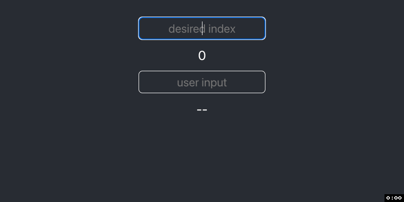
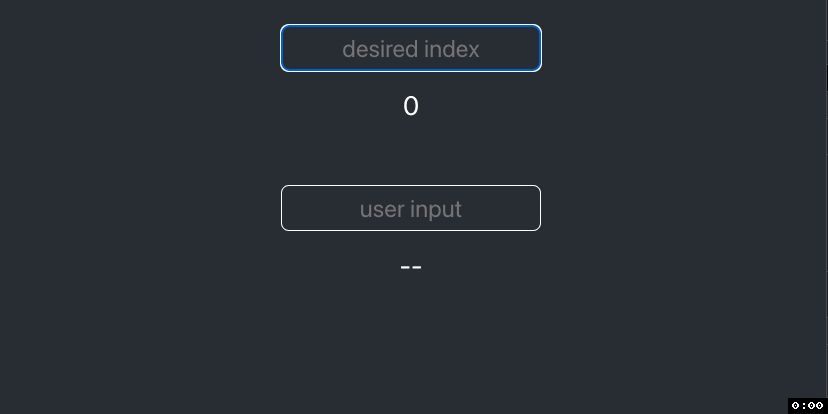

# Demystifying React Hooks – `useMemo`


In this article, we will explore when and how to use React's `useMemo` Hook to
increase your app's performance.

## Getting Started

Buckle up and strap in. This article is on the heavier side for both theory and
length. </br> </br>  If you'd like, you can skim this as a
[Medium](https://medium.com/@austinrt/demystifying-react-hooks-usememo-1219661d0af0)
or [dev.to](https://dev.to/austinrt/demystifying-react-hooks-usememo-28d4)
article.

- `fork and clone`
- `cd client`
- `npm i`
- `npm start`

## Starter Code

We'll begin with a quick overview of our starter code. In `App.js`, you'll find
a function name "`jacobsthal`," two pieces of state, and a variable named
"`calculation`". Notice we wrapped `jacobsthal` in a `useCallback` Hook, and
`calculation` is the returned value from calling `jacobsthal`.

The JSX renders both inputs and their respective values. If you need a refresher
on what service the `useCallback` Hook provides, I'd suggest you pause here and
give my
<a href="https://medium.com/@austinrt/demystifying-react-Hooks-usecallback-7c78fac08947">`useCallback`</a>
article a quick read.

```js
import './App.css';
import { useState, useCallback } from 'react';

function App() {
  const [number, setNumber] = useState('');
  const [input, setInput] = useState('');

  const jacobsthal = useCallback(n => {
    if (n < 2) return n;
    return jacobsthal(n - 1) + 2 * jacobsthal(n - 2);
  }, []);

  const calculation = jacobsthal(number);

  return (
    <div>
      <main>
        <section>
          <div className='user-input'>
            <input
              type='text'
              value={number}
              placeholder='desired index'
              onChange={e => {
                setNumber(e.target.value);
              }}
            />
          </div>
          <div className='result'>{calculation || 0}</div>
        </section>
        <section>
          <div className='user-input'>
            <input
              type='text'
              value={input}
              placeholder='user input'
              onChange={e => {
                setInput(e.target.value);
              }}
            />
          </div>
          <div className='result'>{input || '--'}</div>
        </section>
      </main>
    </div>
  );
}

export default App;
```

</br>
<blockquote>
Our <code>jacobsthal</code> function is a simple, <a href="https://www.geeksforgeeks.org/javascript-memoization/">recursive</a> function that returns the <a href="https://en.wikipedia.org/wiki/Jacobsthal_number">Jacobsthal Number</a> at a given index. The specifics of the code and Jacobsthal Number don't matter for <code>useMemo</code>. All we care about is that it's defined <strong>within</strong> our component, hence the implementation of <code>useCallback</code>, and that it's computationally expensive.
</blockquote>
</br>

If we provide a small value to the `number` input, our React app behaves as
expected, snappily rendering the result. However, as we increase the value of
our input, while the app still provides the desired output, it takes
increasingly longer to render.



## Why is This Happening?

Thirty-five will be our test case because it is slow enough to be annoying but
still testable. So we'll type 35 and wait for the output to calculate.

Now start typing into the second input. See how slow it is to render? That's
because when the input changed, the **entire** component re-rendered, and our
expensive function recalculated the output before re-rendering, even though our
output didn't change.

This is obviously a problem.


<blockquote>A Quick Aside:

Junior Developers make this mistake far too often. You don't always need
<code>useState</code> for your forms. I'll even propose that you **usually
don't**. If no part of your application needs to see the real-time value, like
when submitting a form to an API, you should be using <code>useRef</code>
instead. We will get into how and why in a later article.</blockquote>

So with the stage set and the curtains drawn, how do we resolve the issue at
hand?

## Memoization

Memoization is a Programming technique that stores the **results** of a function
call, so the next time you call that function, it doesn't have to recalculate
the output. Instead, it can return the stored result, saving
[time complexity](https://www.freecodecamp.org/news/time-complexity-of-algorithms/)
with recursive functions.

That's all you need to know for now, but if you'd like a more in-depth
explanation, check out this
[Memoization in JavaScript](https://www.geeksforgeeks.org/javascript-memoization/)
article by GeeksforGeeks. And at the end of this article, we will refactor our
`jacobsthal` function to implement proper JavaScript memoization.

## `useMemo` vs. `useCallback`

To sum it up, `useCallback` stores the **definition** of the function, so it
doesn't unnecessarily **redefine** every render. `useCallback` creates
referential equality between instances of the function across renders.

Similarly, `useMemo` stores the **result** of the function call, so it doesn't
unnecessarily **recalculate** every render. `useMemo` creates referential
equality between instances of the value across renders.

You can already see how this is helpful and leads directly to the primary
purpose of `useMemeo`. In short, the aptly named `useMemo` Hook is React's
built-in memoization tool.

## `useMemo` in Action

Let's write some code!

We'll start by importing `useMemo` from `'react'`.

```js
import { useState, useCallback, useMemo } from 'react';
```

## `useMemo` Syntax

You guessed it, `useMemo` has a similar syntactical skeleton to both `useEffect`
and `useCallback`: an anonymous callback function with a dependency array that
tracks a variable to tell our Hook when to trigger.

```js
useEffect = (() => {}, []);
useCallback = (() => {}, []);
useMemo = (() => {}, []);
```

As in our `useCallback` example, we want to cache what's **returned** from this
Hook. So we will assign our `calculation` variable to the return value of
`useMemo`, wrapping our function call in an anonymous callback.

_Remember to `return` the result of your function call so it is accessible by
`useMemo`!_

```js
const calculation = useMemo(() => {
  return jacobsthal(number);
}, []);
```

After we save, we'll notice a familiar warning from React. Our Hook is missing a
dependency.

```
WARNING in [eslint]
src/App.js
  Line 11:6:  React Hook useMemo has a missing dependency: 'number'. Either include it or remove the dependency array  react-Hooks/exhaustive-deps

webpack compiled with 1 warning
```

Before blindly obeying React's warnings, let's first think through the purpose
of this dependency array and the functionality it extends to our application.

The intent of dependency arrays with React Hooks is to trigger our Hook more
intentionally and specifically. When the value of the variable being `tracked`
changes, the Hook knows it's time to _do its thing_.

In our specific case, when `number` changes, we want our `jacobsthal` function
to recalculate the result.

So let's add `number` to our dependency array.

```js
const calculation = useMemo(() => {
  return jacobsthal(number);
}, [number]);
```

Now that we've memoized our function, let's test it out. We'll start by
typing 35. Our calculation still takes time because our `jacobsthal` function is
still computationally expensive. But now, when we type in the second input, our
React app is again snappy and responsive. It's no longer recalculating our
`jacobsthal` output because `number` has not changed.



## Conclusion (kind of)

Because we memoized the results of our function, we've created referential
equality and eliminated any unnecessary renders, making our React app more
performant.

If you only came here for the React piece, thanks so much for reading, and look
out for the `useRef` article next!

---

But what to do about our computationally expensive `jacobsthal` function? Time
to refactor.

We begin by creating a `previousValues` parameter with a default value of an
empty array. This will be our cache that we will later pass to our recursive
sequence. Doing so will spare our recursive sequence from working overtime.

```js
export const jacobsthal = (n, previousValues = []) => {
  if (n < 2) {
    return n;
  }
  return jacobsthal(n - 1) + 2 * jacobsthal(n - 2);
};
```

Next, inside our code block, we'll create a results variable. We will later
reassign the value, so we'll need to use our `let` keyword.

```js
export const jacobsthal = (n, previousValues = []) => {
  let result;
  if (n < 2) {
    return n;
  }
  return jacobsthal(n - 1) + 2 * jacobsthal(n - 2);
};
```

Instead of returning our computations directly, we'll explicitly wrap our
recursive sequence in an `else` block and assign our `return` options to
`result`.

```js
export const jacobsthal = (n, previousValues = []) => {
  let result;
  if (n < 2) {
    result = n;
  } else {
    result = jacobsthal(n - 1) + 2 * jacobsthal(n - 2);
  }
};
```

Now, after our conditionals have evaluated and assigned a value to `result`, we
set `previousValues` at index `n` equal to our current result, then return
`result`, thus caching this value and making it accessible as a `return`.

```js
export const jacobsthal = (n, previousValues = []) => {
  let result;
  if (n < 2) {
    result = n;
  } else {
    result = jacobsthal(n - 1) + 2 * jacobsthal(n - 2);
  }
  previousValues[n] = result;
  return result;
};
```

Next, the first thing our function should do is check to see if `previousValues`
at index `n` exists. If it does, we `return` it.

```js
export const jacobsthal = (n, previousValues = []) => {
  if (previousValues[n]) {
    return previousValues[n];
  }
  let result;
  if (n < 2) {
    result = n;
  } else {
    result = jacobsthal(n - 1) + 2 * jacobsthal(n - 2);
  }
  previousValues[n] = result;
  return result;
};
```

Lastly, we'll pass `previousValues` as an argument to our recursive sequence.

```js
export const jacobsthal = (n, previousValues = []) => {
  if (previousValues[n]) {
    return previousValues[n];
  }
  let result;
  if (n < 2) {
    result = n;
  } else {
    result =
      jacobsthal(n - 1, previousValues) + 2 * jacobsthal(n - 2, previousValues);
  }
  previousValues[n] = result;
  return result;
};
```

## Conclusions (for real this time)

_Whew_. We can now test our newly (and thoroughly) memoized component. Try 35
again. Pretty snappy, huh? So snappy, in fact, that if we enter 1026 as our
input, it's still responsive. Even calculating '`Infinity`' doesn't crash our
app. And yes, `useMemo` is still doing its thing.

There is no lag in our other input.


If you'd like to dive deeper with useMemo, you can learn more in the
[official React docs](https://beta.reactjs.org/apis/react/useMemo).

> I’m always looking for new friends and colleagues. If you found this article
> helpful and would like to connect, you can find me at any of my homes on the
> web.
>
> [GitHub](https://github.com/austin-rt) |
> [Twitter](https://twitter.com/0xStink) |
> [LinkedIn](https://www.linkedin.com/in/austinrt) |
> [Website](https://austinrt.io) | [Medium](https://austinrt.medium.com/) |
> [Dev.to](https://dev.to/austinrt)

## Resources

- [useMemo](https://beta.reactjs.org/apis/react/useMemo)
- [useCallback](https://medium.com/@austinrt/demystifying-react-Hooks-usecallback-7c78fac08947)
- [Recursion](https://www.freecodecamp.org/news/understanding-recursion-in-javascript-1938884c6be8/)
- [Time Complexity](https://www.freecodecamp.org/news/time-complexity-of-algorithms/)
- [Memoization](https://www.geeksforgeeks.org/javascript-memoization/)
- [Jacobsthal Number](https://en.wikipedia.org/wiki/Jacobsthal_number)
